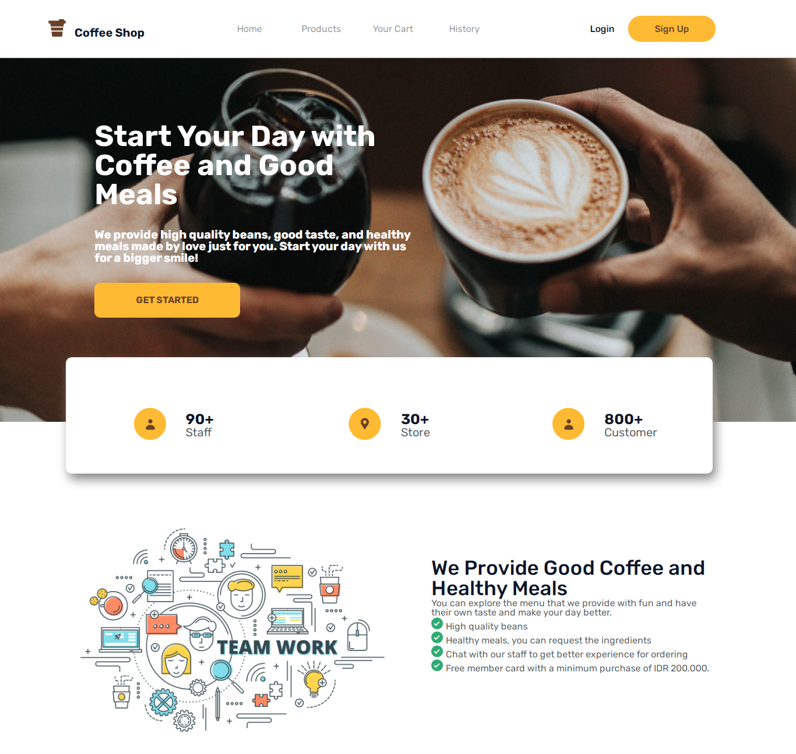
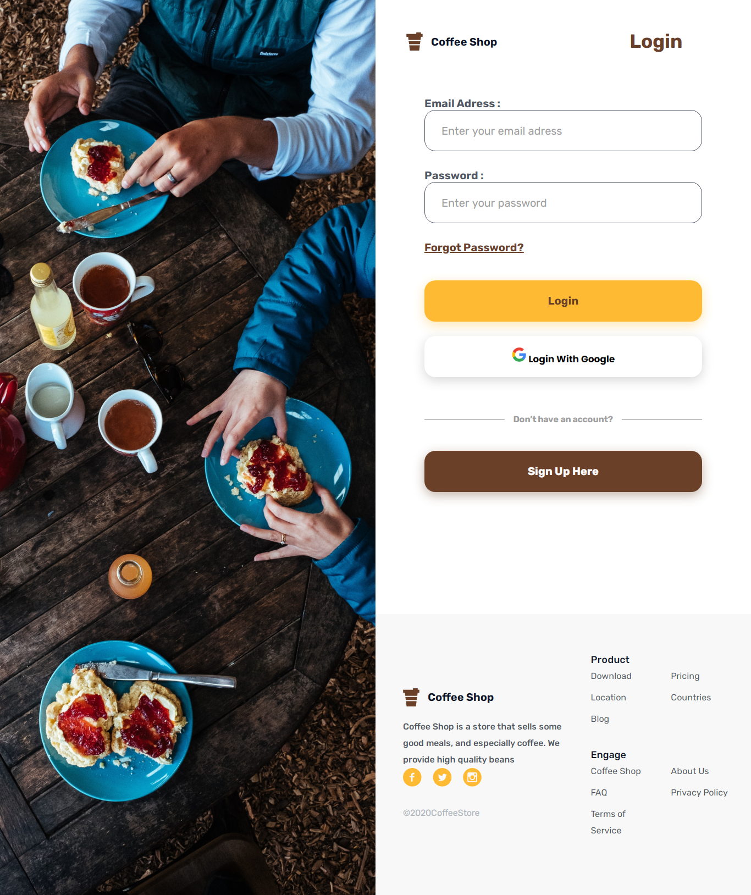
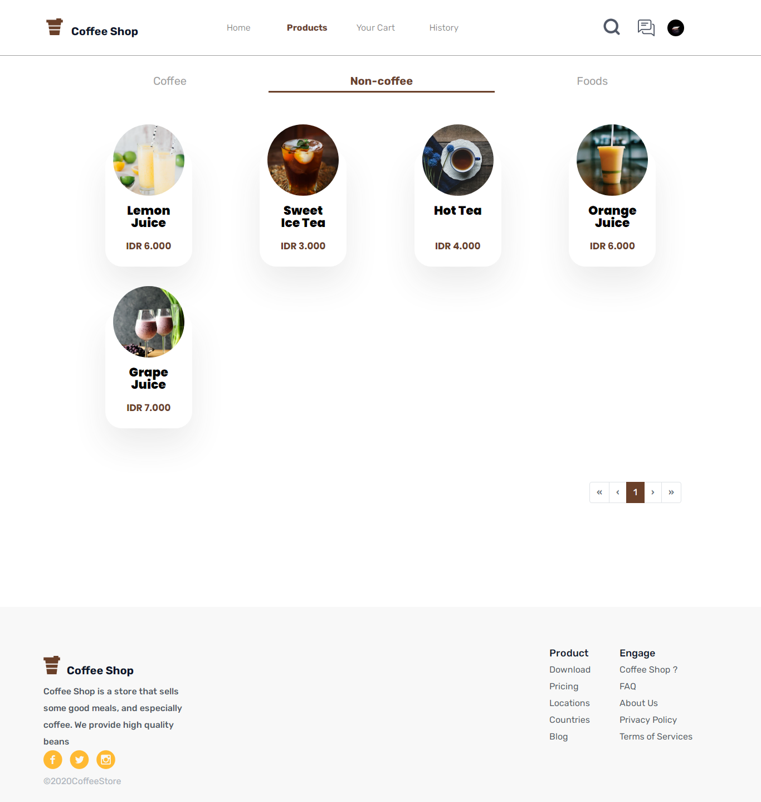
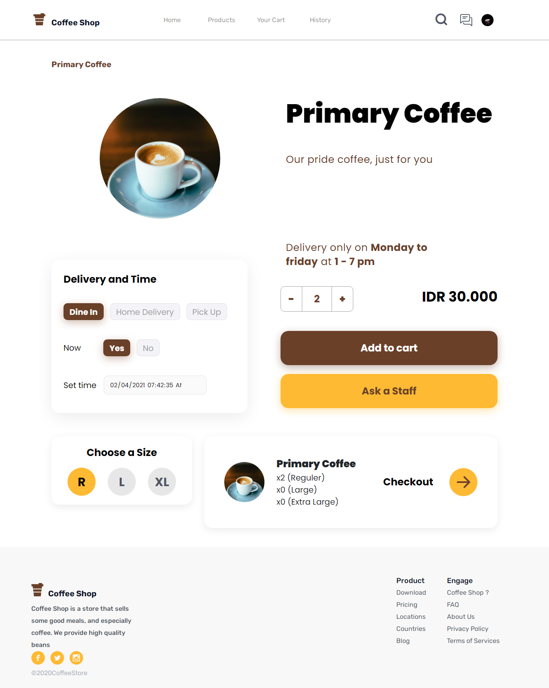
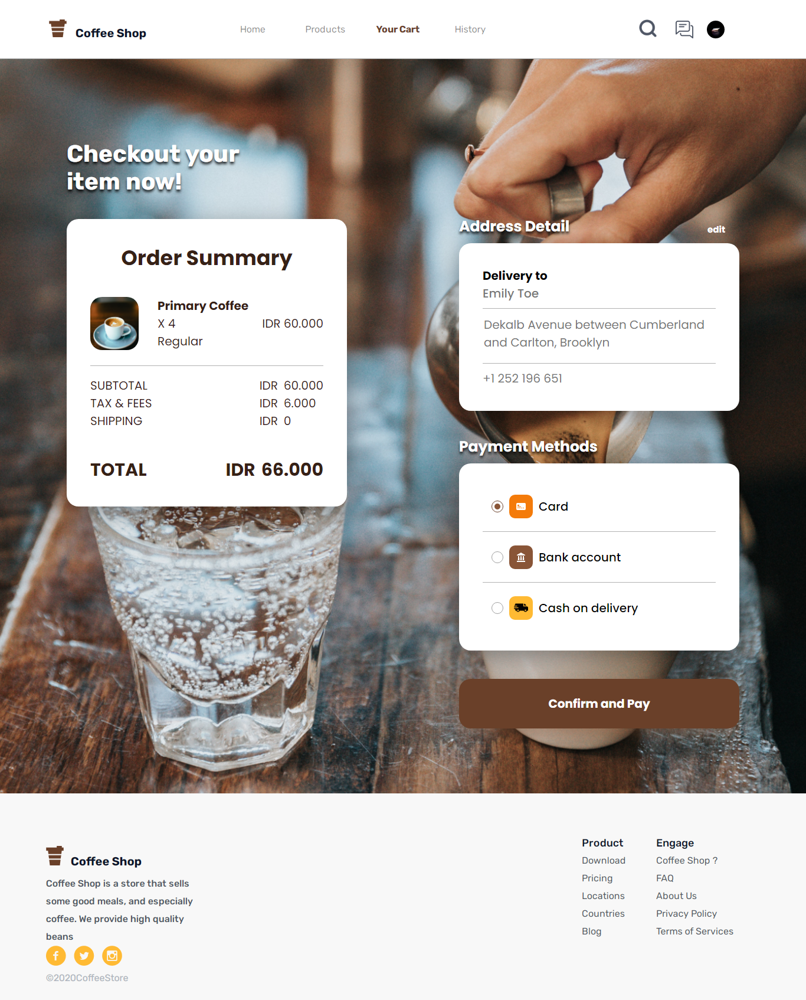
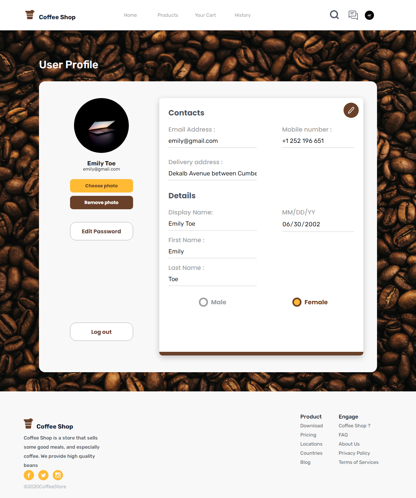

<h1 align="center">Coffky</h1>
<p align="center">
  
</p>
<p align="center">
  Built with Vue JS.
</p>

## Table of Contents

- [Introduction](#introduction)
- [Features](#features)
- [Requirements](#requirements)
- [Usage](#usage-for-development)
- [Create Environment Variable](#create-environment-variable)
- [Screenshots](#screenshots)
- [Website](#website)
- [Related Project](#related-project-backend)
- [Contributors](#contributors)

## Introduction

<b>Coffky</b> is a simple website for ordering food and drinks. The target buyers are people who do not want to queue in the market only through the website of goods can be sent according to procedure.

## Features

- Order any product
- Admin for barista
- Profile
- Checkout any delivery method (dine in, home delivery, pick up)
- Others

## Requirements

- [`npm`](https://www.npmjs.com/get-npm)
- [`Cli Vue JS`](https://cli.vuejs.org/)
- [`Backend Coffky`](https://github.com/FendiAnwarRifai/CoffeeShop-API.git)

## Usage for development

1. Open your terminal or command prompt
2. Type `git clone https://github.com/maulanarifai114/frontend-coffee-shop.git`
3. Open the folder and type `npm install` for install dependencies
4. Create Environment Variable [here](#create-environment-variable)
5. Before run this, you must run backend first
6. Type `npm run serve` for run this app.

## Create Environment Variable

```
$ touch .env.local
$ nano .env.local
```

```
# Set API KEY
VUE_APP_BASE_URL = YOUR_HOST_URL
```

## Screenshots

<div align="center">
     
</div>
<div align="center">
     
</div>
<div align="center">
     
</div>
<div align="center">
     
</div>
<div align="center">
     
</div>
<div align="center">
     
</div>

## Website

<a href="https://coffky.netlify.app/">
  Coffky Website
</a>

## Related Project (Backend)

- [`Backend Coffky`](https://github.com/FendiAnwarRifai/CoffeeShop-API)

## Contributors

<center>
  <table>
    <tr>
      <td align="center">
        <a href="https://github.com/FendiAnwarRifai">
          <br/>
          <sub><b>Fendi Anwar Rifai</b></sub>
        </a>
      </td>
      <td align="center">
        <a href="https://github.com/defri-ansyah">
          <br/>
          <sub><b>Defri Ansyah</b></sub>
        </a>
      </td>
      <td align="center">
        <a href="https://github.com/maulanarifai114">
          <br/>
          <sub><b>Raden Maulana</b></sub>
        </a>
      </td>
      <td align="center">
        <a href="https://github.com/safiratrisa">
          <br/>
          <sub><b>Trisa Safira</b></sub>
        </a>
      </td>
    </tr>
  </table>
</center>